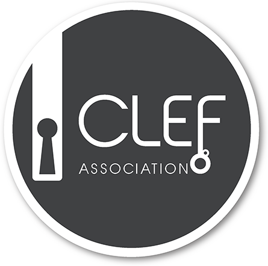

### Home page

**CLEF-HIPE-2020**

**Identifying Historical People, Places and other Entities: Shared Task on Named Entity Recognition and Linking on  Historical Newspapers at CLEF 2020.**

HIPE is a named entity processing evaluation campaign on historical newspapers in French, German and English, organized in the context of the [_impresso_](http://impresso-project.ch) project and run as a [CLEF 2020](https://clef2020.clef-initiative.eu/) Evaluation Lab. In the context of massive digitization of historical documents, the objective is to assess and advance the development of robust named entity processing systems able to deal with challenging, multilingual, diachronic historical material, thereby supporting information extraction and text understanding of cultural heritage data.

**Task 1: Named Entity Recognition and Classification (NERC)**

- **Subtask 1.1 - NERC Essentials**: recognition and classification of high-level entity types: Person, Organisation, Location and Product.
  
- **Subtask 1.2 - NERC fine-grained**: includes ‘NERC Essentials’, plus recognition and
  classification at sub-type level (e.g. Person-individual vs. Person-collective), and detection of NE components (e.g. function, title, name).

**Task 2 : Named Entity Linking (EL)**

- **Subtask 2.1 - Entity coreference resolution**: given a set of mentions *within* 
  documents, the objective is to cluster coreferent mentions and give them a unique
  identifier.
  
- **Subtask 2.2 - Entity Linking**: this task includes the linking of named entity mentions to a
  unique referent in a knowledge base (KB) or to a NIL node if the mention does not have a
  referent in the KB. The chosen KB is [Wikidata](https://wikidata.org).
  
  

### (page) Tasks

### Detailed Task Description

**Task 1: Named Entity Recognition and Classification**

- **Subtask 1.1 - NERC Essentials**: recognition and classification of high-level entity types: Person, Organisation, Location and Product.

- **Subtask 1.2 - NERC fine-grained**: includes ‘NERC Essentials’, plus recognition and
  classification at sub-type level (e.g. Person-individual vs. Person-collective), and detection of NE components (e.g. function, title, name).

**Task 2 : Named Entity Linking (EL)**

- **Subtask 2.1 - Entity coreference resolution**: given a set of mentions *within* 
  documents, the objective is to cluster coreferent mentions and give them a unique
  identifier.
- **Subtask 2.2 - Entity Linking**: this task includes the linking of named entity mentions to a
  unique referent in a knowledge base (KB) or to a NIL node if the mention does not have a
  referent in the KB. The chosen KB is [Wikidata](https://wikidata.org).

### (page) Data sets

Evaluation corpora are composed of articles sampled among several Swiss, Luxembourgish and American historical newspapers on a diachronic basis. 

#### Corpus selection

For each language, articles of different newspapers were sampled on a decade time-bucket basis, according to the time span of the newspaper (longest duration spans ca. 200 years). 

The following selection criteria were used:

- Progammatic:
  - articles should have a title;
  - articles should have more than 50 characters;
  - articles are not restricted to front page only.

- Manual:
  - keep: journalistic content;
  - remove: feuilleton, tabular data, cross-words, meteo, time-schedules, obituaries, and what a human cannot even read because of OCR noise.

  
#### OCR quality

OCR quality corresponds to real-life setting, i.e. it varies according to digitization time and archival material. We do not provide different OCR versions of same texts, but will provide an OCR quality assessment measure alongside each article, as well as images (to be confirmed).

#### Data sets

For each  task, the following data sets will be released:

|             | Fr                   | De                   | En                   |
| ----------- | -------------------- | -------------------- | -------------------- |
| sample data | 20.12.2019           | 20.12.2019           | -                    |
| train       | 31.01.2020           | 31.01.2020           | -                    |
| dev         | 31.01.2020           | 31.01.2020           | 31.01.2020           |
| test        | after the evaluation | after the evaluation | after the evaluation |

Data sets will consists of raw and annotated newspaper content items ('content item' is the neutral term we use to refer to newspaper contents below the page level, e.g. article, advertisement, image, table, weather forecast, obituary. In the HIPE context, mainly content items of type article are considered.

#### Formats

#### Tagset, Annotation campaign & inter-annotator agreements

### Evaluation metrics & scorers

- Scorers will be published at the same time of training data.
- Named Entity Recognition and Classification (Task 1) will be evaluated in terms of macro and micro Precision, Recall and F-measure, and Slot Error Rate. Two evaluation scenarios will be considered: strict (exact boundary matching) and relaxed (fuzzy boundary matching).
- Entity linking and mention clustering (Task 2) will be evaluated in terms of Precision, Recall, F-measure and Linked-based Entity Aware metric.

### Preliminary Timetable

- Early November 2019: registration opens.
- End of November 2019: release of sample data for all tasks and languages.
- End of January 2020: release of full data (training and dev).
- Early May 2020: test phase (one week).
- Early June 2020: release of results to participants.
- June-July 2020: submission of papers (participant and lab- overview papers).
- 22-25 Sept 2020: [CLEF 2020 Conference in Thessaloniki, Greece](https://clef2020.clef-initiative.eu/).

  
### Participation & Registration

- Teams that plan to participate should register via the CLEF 2020 registration portal (more information soon). Registered teams will have access to data as planned in the timetable and additional information.
- It will be possible to participate in one, some or all of the subtasks.
- Up to 3 run per task and per team will be accepted.

###  HIPE Team

####  Organizers

- [Maud Ehrmann](https://impresso-project.ch/consortium/people/#maud-ehrmann) (Digital Humanities Laboratory, EPFL, Switzerland).
- [Matteo Romanello](https://impresso-project.ch/consortium/people/#matteo-romanello)  (Digital Humanities Laboratory, EPFL, Switzerland).
- [Simon Clematide](https://impresso-project.ch/consortium/people/#simon-clematide) (Institute for Computational Linguistics, University of Zurich, Switzerland).

####  Contributors

- Camille Watter (Institute for Computational Linguistics, University of Zurich, Switzerland).
- Alex Flückiger (Institute for Computational Linguistics, University of Zurich, Switzerland).

  
### HIPE Advisory Board

Lab preparation and execution activities are overseen by an advisory board, composed of the following persons:

- [**Dr. Richard Eckart de Castillo**]( https://www.informatik.tu-darmstadt.de/ukp/ukp_home/staff_ukp/detailseite_mitarbeiter_1_42176.en.jsp), Senior Researcher at Ubiquitous Knowledge Processing (UKP) Department of Computer Sciences, Technische Universität Darmstadt, Germany.
- [**Clemens Neudecker**](https://cneud.net/ ), Digital Library Researcher & Project Manager at Berlin State Library, Germany.
- [**Dr. Sophie Rosset**](https://perso.limsi.fr/rosset/EN/index.php), Senior Researcher at LIMSI-CNRS (French National Centre for Scientific Research), Paris-Orsay, France.
- [**Prof. David Smith**](https://www.khoury.northeastern.edu/people/david-smith/), Professor at Khoury College of Computer Sciences, Northeastern University, Boston, US.

 
 

